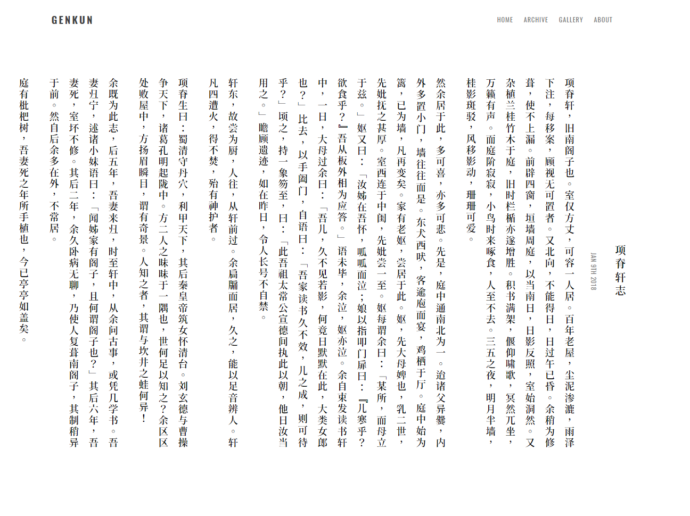

# HIRUKO

A SIMPLE, CLEAN and POWERFUL theme for [Hexo].

- [Preview](https://blog.genkun.me)

Inspired by [Prince](https://github.com/yiliashaw/hexo-theme-prince), [Free Mind](http://freemind.pluskid.org/) and [Fate/Typo](https://fatetypo.xyz)

## Features

### MathJax

**Usage**: Add `mathjax: true` to the posts which need MathJax rendering.

**Recommend**: remove `hexo-renderer-marked` and install `hexo-renderer-kramed`.

### Disqus Comments

**Usage**: Add your Disqus id to the `_config.yml`.

```yml
comment:
    id: your_disqus_id
```

### Vertical Layout

**Preview**: 

**Usage**: Add `vertical: true` to the posts.

### Web-Fonts

Powered by [Font-Spider](https://github.com/aui/font-spider).

## Installation

### Install

``` bash
$ npm install hexo-renderer-jade --save
$ git clone https://github.com/GenkunAbe/hexo-theme-hiruko.git themes/hiruko
```

### Enable

Modify `theme` setting in `_config.yml` to `hiruko`.

### Update

``` bash
cd themes/hiruko
git pull
```